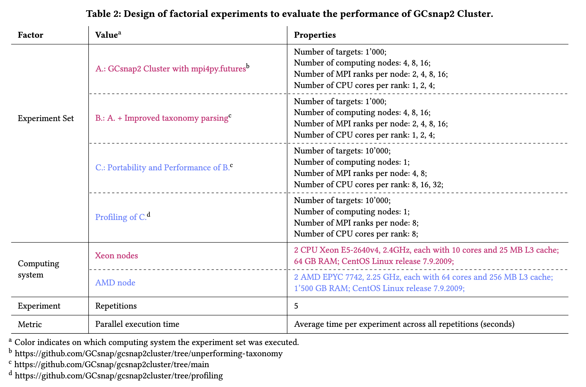

# Scalable Genomic Context Analysis with GCsnap2 on HPC Clusters

The following is a description of artifacts necessary to reproduce the paper under review “Scalable Genomic Context Analysis with GCsnap2 on HPC Clusters”.

Tables 2 present an overview of all conducted tests and experiments.

## Directory Structure
The absolute paths are masked '/.../' and need to be adapted according to where you cloned this repository in all scripts.

### [conda_envs/](./conda_envs/)  
Contains the YML files for the Conda environments used. For package end environmental management, we employed [Miniconda](https://docs.anaconda.com/miniconda/) which was shipped with Conda 24.9.2 and Python 3.12.3.
### [plots/](./plots/)
Jupyter notebook to create all plots show in the paper with the results provided below.
### [targets/](./targets/)
Input sequences used for the experiments based on the combined summary contained in overall uniprot ID file.
- [Overall uniprot ID file](./targets/dark_galaxies_gcsnap_done_uniprot_ids_update.txt)
- [create_targets.sh](./targets/create_targets.sh): Script to create the target files containing 1000 and 10'000 sequences.  
The files with target size 10,20,50 and 100 were created handish to have sequences that share genomic context.
- [target_sequences_*.txt](./targets/): Files containing different number of targets.  
- [assembly_urls.txt](./targets/assembly_urls.txt): File containing the urls for 10'000 assembly files used for the assembly parsing tests with mpi4py.futuers and Dask.jobqueue. Due to size limits, it is not possible to provide the actual files.
### [experiments/](./experiments/)  

Each experiment folder contains the execution script (.sh), the job script submitted to the cluster managemer, e.g. SLURM (.job) inluding the information which Conda environment is used, and a folder with all the results from each tested configuration. To keep the size managable, the results do not include HTML, PNG, JSON, and the all-against-all sequence similarity intermediate directories.
The information used for the plots is available either in TSV files for GCsnap1 Desktop, or CSV files for GCsnap2 Cluster.

To be able to reproduce the results, [GCsnap1 Desktop with timings](https://github.com/RetoKrummenacher/GCsnap/tree/timing) and [GCsnap2 Cluster v1.0.0](https://github.com/GCsnap/gcsnap2cluster) are necessary. Instructions how to install and use are found there.

#### [gcsnap1](./experiments/gcsnap1/)
Tests with GCsnap1 Desktop to measure execution time with various number of input sequences (targets) and Python threads.
- Run file: experiment.sh
- Job script: run.job
- [Results](./experiments/gcsnap1/results/)
    - Naming convention for each configuration: X_targets_X_threads_X_rep  
    - Timing results in times_*.TSV 
    - Runtime arguments in *_input_arguments.LOG
    - Terminal output in out_*.TXT
#### [dask_distributed_assemblies](./experiments/dask_distributed_assemblies/)
Tests to asses Dask.jobqueue
- Run file: dask_distributed_assemblies.sh
- Job script: dask_distributed_assemblies.job
- Python script: dask_distributed_assembly_parsing.py
- [Results](./experiments/dask_distributed_assemblies/results/)  
    - Naming convention for each configuration: targets_nodes_cpus_rep 
    - Timing results in CSV
#### [mpi_distributed_assemblies](./experiments/mpi_distributed_assemblies/)
Tests to asses mpi4py.futures.
- Run file: mpi_distributed_assemblies.sh
- Job script: mpi_distributed_assemblies.job
- Python script: mpi_distributed_assembly_parsing.py
- [Results](./experiments/mpi_distributed_assemblies/results/)  
    - Naming convention for each configuration: targets_nodes_cpus_rep 
    - Timing results in CSV
#### [setA](./experiments/setA/)
Experiments with GCsnap2 Cluster with mpi4py.futures (A.) to measure execution time with 1'000 input sequences.
- Run file: experiment.sh
- Job script: run.job
- [Results](./experiments/setA/results/)  
    - Naming convention for each configuration: 1000_targets_X_nodes_X_ranks_X_cpus_X_rep
    - Timing results in timing.CSV 
    - Runtime arguments in input_arguments.LOG
    - Terminal output in run_*.OUT
    - Full logging in gcsnap_*.LOG
#### [setB](./experiments/setB/)
Experiments with GCsnap2 Cluster with mpi4py.futures with improved taxonomy parsing (B.) to measure execution time with 1'000 input sequences.
- Run file: experiment.sh
- Job script: run.job
- [Results](./experiments/setB/results/)  
    - Naming convention for each configuration: 1000_targets_X_nodes_X_ranks_X_cpus_X_rep
    - Timing results in timing.CSV 
    - Runtime arguments in input_arguments.LOG
    - Terminal output in run_*.OUT
    - Full logging in gcsnap_*.LOG
#### [setC](./experiments/setC/)
Scaling experiments with GCsnap2 Cluster (B.) to measure execution time with 10'000 input sequences.
- Run file: experiment.sh
- Job script: run.job
- [Results](./experiments/setC/results/)  
    - Naming convention for each configuration: 10000_targets_1_nodes_X_ranks_X_cpus_X_rep
    - Timing results in timing.CSV 
    - Runtime arguments in input_arguments.LOG
    - Terminal output in run_*.OUT
    - Full logging in gcsnap_*.LOG
#### [MPIprofiling](./experiments/MPIprofiling/)
Scaling experiments with GCsnap2 Cluster (C.) to measure execution time with 10'000 input sequences for each MPI rank
- Run file: experiment.sh
- Job script: run.job
- [Results](./experiments/MPIprofiling/results/)  
    - Naming convention for each configuration: 10000_targets_1_nodes_X_ranks_X_cpus_X_rep
    - Timing results in timing.CSV 
    - Runtime arguments in input_arguments.LOG
    - Terminal output in run_*.OUT
    - Full logging in gcsnap_*.LOG
- [Rank Results](./experiments/MPIprofiling/)  
    - Log files for each substep of GCsnap2 Cluster and each rank: rank_rep_?

